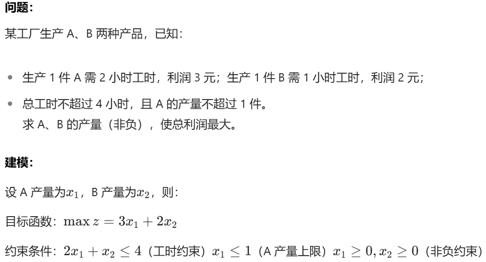
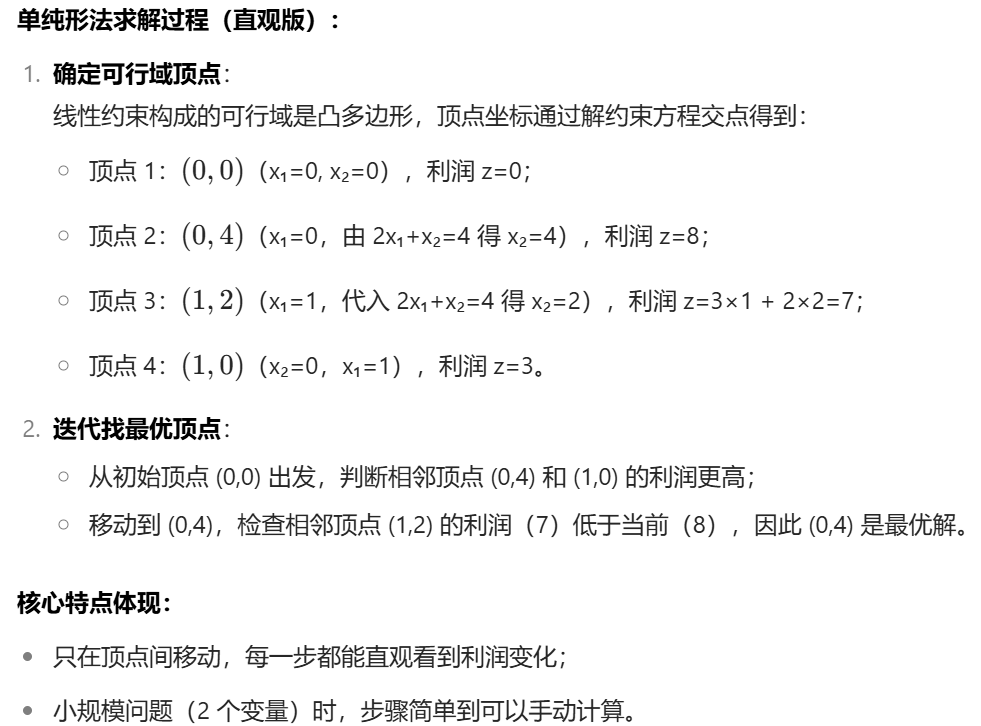
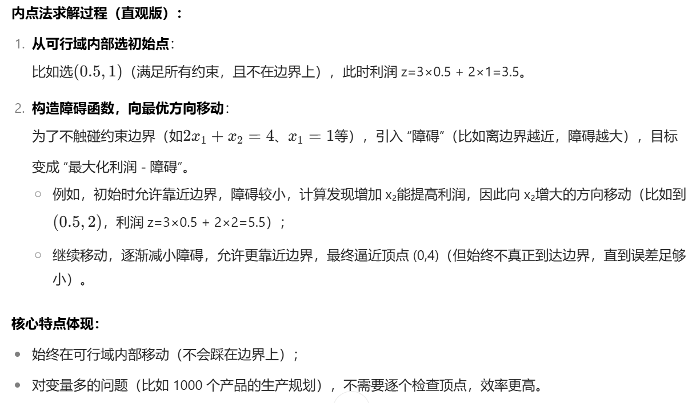

今天我们来学习线性规划。线性规划与线性回归的名字十分类似，但是他们解决的问题却截然不同。
**线性回归**解决的是预测、分析类问题，题目会给我们一些数据，让我们去拟合出最优线性方程，从而解释变量间的关联或预测未知数据。
**线性规划**则是解决优化类问题，目的是在线性约束条件下，求解线性目标函数的最优解（最大值或最小值）。
线性这一词体现在两者的数学模型都基于线性性,如y=2x1+3x2，不会出现x²，1/X之类的。

# 一、线性规划是什么
线性规划（Linear Programming, LP）是数模竞赛中最基础也最常用的优化模型之一，其核心是在**线性约束条件**下求解线性目标函数的最优解，我们常常会研究 “在一组线性等式或不等式约束下，如何使一个线性目标函数达到最大值或最小值” 的数学方法。其本质是在凸多边形（高维空间中为凸多面体）内寻找目标函数的极值点。
这个凸多面体如何理解呢，其实就是想象一个高维空间，题目给出的线性约束条件在这个高维空间中构成了一个凸多面体，答案的条件取值就落在这个凸多面体内。

# 二、线性规划的两种解法
接下来介绍线性规划的两种常见解法
## 1、单纯形法
单纯形法是一种顶点迭代算法，专门用于求解线性规划问题。其核心逻辑基于线性规划的一个重要性质：最优解（若存在）必定在刚刚提到的凸多面体的顶点上。简单来说，它的步骤是：
（1） 从一个初始顶点（基可行解）出发，通过判断当前顶点是否为最优解（最优性检验）
（2） 若不是，就迭代到 “更优” 的相邻顶点
（3） 重复迭代，直到找到最优顶点（或判断无界 / 无解）
单纯形法适用于中小规模问题（变量、约束数的数目≤10^4）求解效率极高，步骤直观，易理解，同时能直接判断问题是否无可行解、无界解，结果解释性强。但是对于大规模问题，迭代次数可能激增，所以就要用到下面的方法：内点法。
## 2、内点法
内点法是一种内部迭代算法，它不依赖可行域的顶点，而是从可行域内部的一个点出发，通过引入 “障碍函数”（如对数障碍函数）将约束条件融入目标函数，转化为无约束优化问题，逐步向最优解逼近（始终在可行域内部移动）。简单来说，它的步骤是：
（1） 构造含障碍参数的 “惩罚目标函数”（障碍参数控制约束的严格程度）；
（2） 用梯度下降等方法求解无约束优化问题，得到内部点；
（3） 逐步减小障碍参数，重复迭代，直到逼近最优解。

# 三、线性规划例题讲解
接下来我们通过一道简单的例题来理解这两种办法。

## 1、单纯形法解析

## 2、内点法解析


# 四、两种解法的代码实现
以下代码均由python实现，由deepseek提供。
## 1、单纯形法
``` python
import numpy as np

def simplex(c, A, b):
    """
    单纯形法求解线性规划问题:
        min c^T x
        s.t. A x = b
             x >= 0
    
    参数:
        c: 目标函数系数向量 (n维数组)
        A: 约束系数矩阵 (m x n矩阵)
        b: 约束右侧向量 (m维数组)
    
    返回:
        x: 最优解向量
        obj: 最优目标值
    """
    m, n = A.shape
    # 构造初始单纯形表
    tableau = np.zeros((m + 1, n + m + 1))
    tableau[:m, :n] = A
    tableau[:m, n:n + m] = np.eye(m)  # 添加松弛变量
    tableau[-1, :n] = c
    tableau[:m, -1] = b
    basis = list(range(n, n + m))  # 初始基变量索引
    
    while np.any(tableau[-1, :-1] < 0):
        # 选择入基变量 (Bland规则避免循环)
        entering = np.where(tableau[-1, :-1] < 0)[0][0]
        
        # 计算离基比率
        ratios = tableau[:-1, -1] / tableau[:-1, entering]
        ratios[ratios <= 0] = np.inf
        if np.all(ratios == np.inf):
            raise ValueError("问题无界")
        
        # 选择离基变量
        leaving_idx = np.argmin(ratios)
        leaving = basis[leaving_idx]
        
        # 更新基
        basis[leaving_idx] = entering
        
        # 高斯消元使入基列变为单位向量
        pivot = tableau[leaving_idx, entering]
        tableau[leaving_idx] /= pivot
        for i in range(m + 1):
            if i != leaving_idx:
                tableau[i] -= tableau[i, entering] * tableau[leaving_idx]
    
    # 提取解
    x = np.zeros(n + m)
    for i in range(m):
        if basis[i] < n:
            x[basis[i]] = tableau[i, -1]
    obj = -tableau[-1, -1]
    
    return x[:n], obj

# 示例使用
if __name__ == "__main__":
    # 问题: min -3x1 -2x2
    #       s.t. 2x1 + x2 <= 100
    #             x1 + x2 <= 80
    #             x1 <= 40
    #             x1, x2 >= 0
    
    # 转化为标准形式: 
    c = np.array([-3, -2, 0, 0, 0])  # 添加松弛变量0,0,0,目的是把不等式关系转化为等式关系
    A = np.array([
        [2, 1, 1, 0, 0],
        [1, 1, 0, 1, 0],
        [1, 0, 0, 0, 1]
    ])
    b = np.array([100, 80, 40])
    
    x_opt, obj_val = simplex(c, A, b)
    print("单纯形法结果:")
    print(f"最优解: x = {x_opt}")
    print(f"最优值: {obj_val:.4f}")
```
## 2、内点法
``` python
import numpy as np

def interior_point(c, A, b, tol=1e-8, max_iter=100):
    """
    原始-对偶内点法求解线性规划:
        min c^T x
        s.t. A x = b
             x >= 0
    
    参数:
        c: 目标函数系数向量 (n维数组)
        A: 约束系数矩阵 (m x n矩阵)
        b: 约束右侧向量 (m维数组)
        tol: 收敛容忍度
        max_iter: 最大迭代次数
    
    返回:
        x: 最优解向量
        obj: 最优目标值
    """
    m, n = A.shape
    x = np.ones(n)  # 初始原始解
    lam = np.zeros(m)  # 初始对偶变量
    s = np.ones(n)  # 初始对偶松弛变量
    
    for _ in range(max_iter):
        # 计算对偶间隙和中心参数
        mu = np.dot(x, s) / n
        if mu < tol:
            break
            
        # 构造KKT系统右侧向量
        r1 = A @ x - b
        r2 = A.T @ lam + s - c
        r3 = x * s
        
        # 构造系数矩阵
        X_inv = np.diag(1 / x)
        S = np.diag(s)
        M = A @ np.diag(x / s) @ A.T
        
        # 求解线性系统
        d_lam = np.linalg.solve(M, r1 + A @ (x * r2 - r3) / s)
        d_s = -r2 + A.T @ d_lam
        d_x = -(x * d_s + r3) / s
        
        # 计算步长
        alpha_p = min(1, 0.99 * min(-x[d_x < 0] / d_x[d_x < 0], default=1))
        alpha_d = min(1, 0.99 * min(-s[d_s < 0] / d_s[d_s < 0], default=1))
        
        # 更新迭代点
        x += alpha_p * d_x
        lam += alpha_d * d_lam
        s += alpha_d * d_s
    
    obj = np.dot(c, x)
    return x, obj

# 示例使用
if __name__ == "__main__":
    # 相同问题: min -3x1 -2x2
    c = np.array([-3, -2])
    A = np.array([
        [2, 1],
        [1, 1],
        [1, 0]
    ])
    b = np.array([100, 80, 40])
    
    x_opt, obj_val = interior_point(c, A, b)
    print("\n内点法结果:")
    print(f"最优解: x = {x_opt}")
    print(f"最优值: {obj_val:.4f}")
```