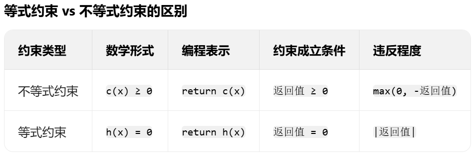

今天我们来学习线性规划。之前我们学过线性规划是什么，那么非线性规划也很好理解，**非线性**这一词体现在其数学模型不一定基于线性性,可能会出现x²，1/X之类的元素。

# 一、非线性规划是什么
非线性规划（Nonlinear Programming，简称 NLP）是研究目标函数或约束条件中包含非线性函数的最优化问题。
- 与线性规划的核心区别：
**线性规划**中，目标函数和约束都是线性的（形如a1x1+a 2x2+...+anxn），可行域是凸多边形（或凸多面体），最优解一定在顶点上；
**非线性规划**中，至少有一个函数是非线性的（如x²，√x等），可行域可能是**不规则的非凸区域**，最优解可能在内部或边界，且可能存在多个局部最优解。
非线性规划与线性规划一样，约束条件既有等式约束也有不等式约束.

# 二、非线性规划的核心分类（按 “凸性” 划分）
## 1、凸规划与非凸规划
**（1）凸规划**定义：若目标函数f(x)是凸函数，且不等式约束g(x)≤0是凸函数（即可行域是凸集），则称为凸规划。
- 关键性质：
  凸规划的局部最优解一定是全局最优解（只有一个 “最低点”）
  求解简单，普通算法（如梯度下降）即可找到最优解

**（2）非凸规划**定义：不满足凸规划条件的非线性规划（如目标函数是凹函数、约束是凹函数，或存在非凸项如x³、sin(x²)等）。
- 关键难点：
  存在多个局部最优解（多个 “小坑”），普通算法可能陷入局部最优，找不到全局最优
  求解复杂，需要特殊策略（如多次初始化、全局优化算法）

## 2、两者的区别
凸性是非线性规划中最重要的性质，直接决定问题的难度和求解结果的可靠性。为什么呢？
**凸函数**中集合C中任意两点的连线（线段）仍完全包含在C中，其约束的可行域比较容易求。所以凸性赋予优化问题简单且规则的结构，使得求解算法能高效收敛到全局最优解。
**凹函数**中，两点连线可能穿出集合，导致我们在求解的时候会难度陡增，结果可靠性差的，而且还会陷入局部最优的陷阱。

# 三、非线性规划的常用求解方法（竞赛重点）
## 1. 无约束非线性规划（无等式 / 不等式约束）
即仅求解minf(x)，核心是利用函数的梯度（一阶导数）或 Hessian 矩阵（二阶导数）寻找下降方向。
- **梯度下降法（Gradient Descent）**：
  原理：沿梯度（函数上升最快的方向）的反方向逐步移动，直到梯度接近 0（平缓区域）
  适用：目标函数可导，凸函数或简单非凸函数（如二次函数）
  缺点：对非凸函数易陷入局部最优
- **拟牛顿法（如 BFGS）**：
  原理：用近似矩阵代替 Hessian 矩阵的逆，兼顾牛顿法的速度和梯度下降的简单性
  适用：大规模无约束问题（变量多，计算 Hessian 困难时）

## 2. 有约束非线性规划（带等式 / 不等式约束）
- **序列二次规划（SQP，Sequential Quadratic Programming）**：
  原理：每一步用二次规划（凸的）近似原问题，逐步逼近最优解，是目前约束非线性规划中最有效的方法之一
  适用：大规模、复杂约束问题（数模竞赛中最常用，如 MATLAB 的fmincon默认用 SQP）
- **内点法（Barrier Method）**：
  原理：类似线性规划的内点法，在可行域内部引入障碍函数（离边界越近障碍越大），避免触碰边界，适合不等式约束问题

#### 若目标函数非凸，存在多个局部最优解，可能需用全局优化算法（如模拟退火、遗传算法）求解。

# 四、数模竞赛中处理非线性规划的步骤
1、建模时识别非线性项：
- 检查目标函数和约束中是否有平方、开方、乘积、指数、三角函数等，若有则判定为非线性规划。

2、判断是否为凸规划：
- 凸函数判定：对一元函数，二阶导数≥0；对多元函数，**Hessian 矩阵半正定**（可借助工具验证）。
    - 若为凸规划：直接用常规算法（如 SQP），结果可信（全局最优）。
    - 若为非凸规划：需用多次初始化（不同初始点）、全局优化算法（如 MATLAB 的globalsearch），并验证结果是否为全局最优。
  
3、选择求解工具：
- MATLAB：fmincon（约束问题，支持 SQP、内点法等）、fminsearch（无约束，简单问题）、globalsearch（全局优化）。
- Python：scipy.optimize.minimize（支持多种算法）、pulp（需结合其他库）。
**注意**：工具默认可能返回局部最优，非凸问题需手动设置参数（如初始点、算法类型）。

# 五、核心算法的实现
## 1、无约束非线性规划方法
### （1）梯度下降法 (Gradient Descent)
- **适用场景**：可微函数，中等规模问题
- **核心思想**：沿负梯度方向迭代更新
``` python
import numpy as np

def gradient_descent(f, grad_f, x0, lr=0.01, max_iter=1000, tol=1e-6):
    """
    梯度下降法求解无约束优化问题
    
    参数:
        f: 目标函数
        grad_f: 梯度函数
        x0: 初始点
        lr: 学习率
        max_iter: 最大迭代次数
        tol: 收敛容忍度
    
    返回:
        x: 最优解
        history: 迭代历史
    """
    x = np.array(x0, dtype=float)
    history = [x.copy()]
    
    for i in range(max_iter):
        grad = grad_f(x)
        if np.linalg.norm(grad) < tol:
            break
        
        # 更新点
        x = x - lr * grad
        history.append(x.copy())
    
    return x, np.array(history)

# 示例使用
if __name__ == "__main__":
    # 定义目标函数: Rosenbrock函数，是一个测试函数
    def rosenbrock(x):
        return (1 - x[0])**2 + 100 * (x[1] - x[0]**2)**2
    # 计算Rosenbrock 函数的梯度（一阶偏导数），需手动计算
    def rosen_grad(x):
        return np.array([
            -2*(1 - x[0]) - 400*x[0]*(x[1] - x[0]**2),
            200*(x[1] - x[0]**2)
        ])
    
    # 初始点
    x0 = [-1.5, 2.0]
    
    # 运行梯度下降
    x_opt, history = gradient_descent(rosenbrock, rosen_grad, x0, lr=0.001, max_iter=10000)
    
    print("梯度下降法结果:")
    print(f"最优解: x = {x_opt}")
    print(f"最优值: f(x) = {rosenbrock(x_opt):.6f}")
    print(f"迭代次数: {len(history)}")
```

### （2）BFGS算法 (拟牛顿法)
- **适用场景**：可微函数，收敛速度快，无需计算Hessian矩阵
- **核心思想**：通过迭代逼近Hessian矩阵的逆
``` python
import numpy as np
from scipy.optimize import minimize

def bfgs_optimize(f, grad_f, x0, max_iter=1000, tol=1e-6):
    """
    BFGS算法求解无约束优化问题
    
    参数:
        f: 目标函数
        grad_f: 梯度函数
        x0: 初始点
        max_iter: 最大迭代次数
        tol: 收敛容忍度
    
    返回:
        result: 优化结果对象
    """
    # 使用Scipy的BFGS实现
    result = minimize(
        f, 
        x0, 
        method='BFGS',
        jac=grad_f,
        options={'maxiter': max_iter, 'gtol': tol}
    )
    
    return result

# 示例使用
if __name__ == "__main__":
    # 定义目标函数: Himmelblau函数是一个经典的非线性测试函数，用于测试模型
    def himmelblau(x):
        return (x[0]**2 + x[1] - 11)**2 + (x[0] + x[1]**2 - 7)**2
    # 计算函数的梯度（一阶偏导数）
    def himmel_grad(x):
        dx0 = 2*(x[0]**2 + x[1] - 11)*2*x[0] + 2*(x[0] + x[1]**2 - 7)
        dx1 = 2*(x[0]**2 + x[1] - 11) + 2*(x[0] + x[1]**2 - 7)*2*x[1]
        return np.array([dx0, dx1])
    
    # 初始点
    x0 = [0, 0]
    
    # 运行BFGS
    result = bfgs_optimize(himmelblau, himmel_grad, x0)
    
    print("\nBFGS算法结果:")
    print(f"最优解: x = {result.x}")
    print(f"最优值: f(x) = {result.fun:.6f}")
    print(f"迭代次数: {result.nit}")
```

## 2、有约束非线性规划方法
### （1）序列二次规划 (SQP)
- **适用场景**：具有等式/不等式约束的优化问题
- **核心思想**：将原问题转化为一系列二次规划子问题
```python
import numpy as np
from scipy.optimize import minimize

def sqp_optimize(f, grad_f, x0, constraints, max_iter=1000, tol=1e-6):
    """
    SQP算法求解有约束优化问题
    
    参数:
        f: 目标函数
        grad_f: 梯度函数
        x0: 初始点
        constraints: 约束条件列表
        max_iter: 最大迭代次数
        tol: 收敛容忍度
    
    返回:
        result: 优化结果对象
    """
    # 使用Scipy的SLSQP实现(SQP的一种)
    result = minimize(
        f,
        x0,
        method='SLSQP',
        jac=grad_f,
        constraints=constraints,
        options={'maxiter': max_iter, 'ftol': tol}
    )
    
    return result

# 示例使用
if __name__ == "__main__":
    # 定义目标函数
    def objective(x):
        return x[0]**2 + x[1]**2 + x[0]*x[1] + np.exp(x[0])
    
    # 定义梯度
    def grad_objective(x):
        return np.array([
            2*x[0] + x[1] + np.exp(x[0]),
            2*x[1] + x[0]
        ])
    
    # 定义约束条件
    # 不等式约束: c(x) >= 0
    def constraint1(x):
        return x[0] + x[1] - 5  # x0 + x1 >= 5
    
    def constraint2(x):
        return 10 - x[0]**2 - x[1]**2  # x0^2 + x1^2 <= 10
    
    # 等式约束: h(x) = 0
    def constraint3(x):
        return x[0] - 2*x[1] + 3  # x0 - 2x1 = -3
    
    constraints = [
        {'type': 'ineq', 'fun': constraint1},
        {'type': 'ineq', 'fun': constraint2},
        {'type': 'eq', 'fun': constraint3}
    ]
    
    # 初始点
    x0 = [0.0, 0.0]
    
    # 运行SQP
    result = sqp_optimize(objective, grad_objective, x0, constraints)
    
    print("\nSQP算法结果:")
    print(f"最优解: x = {result.x}")
    print(f"最优值: f(x) = {result.fun:.6f}")
    print(f"迭代次数: {result.nit}")
```
### （2）内点法 (Interior-Point Method)
- **适用场景**：具有不等式约束的大规模问题
- **核心思想**：通过障碍函数将约束问题转化为无约束问题序列
```python
import numpy as np
from scipy.optimize import minimize

def interior_point(f, grad_f, x0, constraints, max_iter=1000, tol=1e-6):
    """
    内点法求解有约束优化问题
    
    参数:
        f: 目标函数
        grad_f: 梯度函数
        x0: 初始点
        constraints: 约束条件列表
        max_iter: 最大迭代次数
        tol: 收敛容忍度
    
    返回:
        result: 优化结果对象
    """
    # 使用Scipy的trust-constr实现(内点法的一种)
    result = minimize(
        f,
        x0,
        method='trust-constr',
        jac=grad_f,
        constraints=constraints,
        options={'maxiter': max_iter, 'xtol': tol}
    )
    
    return result

# 示例使用
if __name__ == "__main__":
    # 定义目标函数
    def objective(x):
        return np.exp(x[0]) + x[1]**2 + x[0]*x[1]
    
    # 定义梯度
    def grad_objective(x):
        return np.array([
            np.exp(x[0]) + x[1],
            2*x[1] + x[0]
        ])
    
    # 定义约束条件
    # 不等式约束: c(x) >= 0
    def constraint1(x):
        return x[0] - 1  # x0 >= 1
    
    def constraint2(x):
        return x[1] - 2  # x1 >= 2
    
    # 等式约束: h(x) = 0
    def constraint3(x):
        return x[0] + x[1] - 5  # x0 + x1 = 5
    
    constraints = [
        {'type': 'ineq', 'fun': constraint1},
        {'type': 'ineq', 'fun': constraint2},
        {'type': 'eq', 'fun': constraint3}
    ]
    
    # 初始点 (需满足不等式约束)
    x0 = [1.5, 3.0]
    
    # 运行内点法
    result = interior_point(objective, grad_objective, x0, constraints)
    
    print("\n内点法结果:")
    print(f"最优解: x = {result.x}")
    print(f"最优值: f(x) = {result.fun:.6f}")
    print(f"迭代次数: {result.nit}")
```

# 六、个人心得
## 1、约束条件的表述
### （1）松弛变量
之前我们学习线性规划的时候引入了松弛变量把不等式条件转换为等式条件，为什么今天我们不用呢。其实是否需要引入松弛变量得看具体的算法要求，例如之前学线性规划时需要用矩阵解题，所以我们才需要引入松弛变量构建矩阵，从而实现代码的运行。而今天学习非线性规划的这几种方法都不需要用到矩阵，所以可以直接return。如果我们解决问题时的算法是需要等式约束形式的算法，我们可以自行引入条件变量。
### （2）不等式条件与等式条件return的方法
大家可以注意到上述代码中，无论是等式条件还是不等式条件，我们都是直接return条件式子，看上去没有区别，实际上在程序中我们是看返回值来确定是否符合条件，而违反程度也可以知道，如下图图示：
