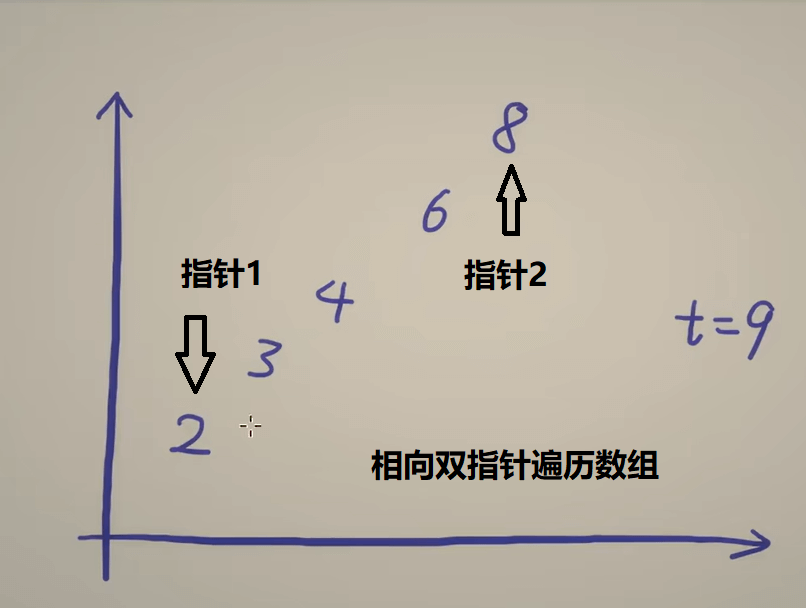
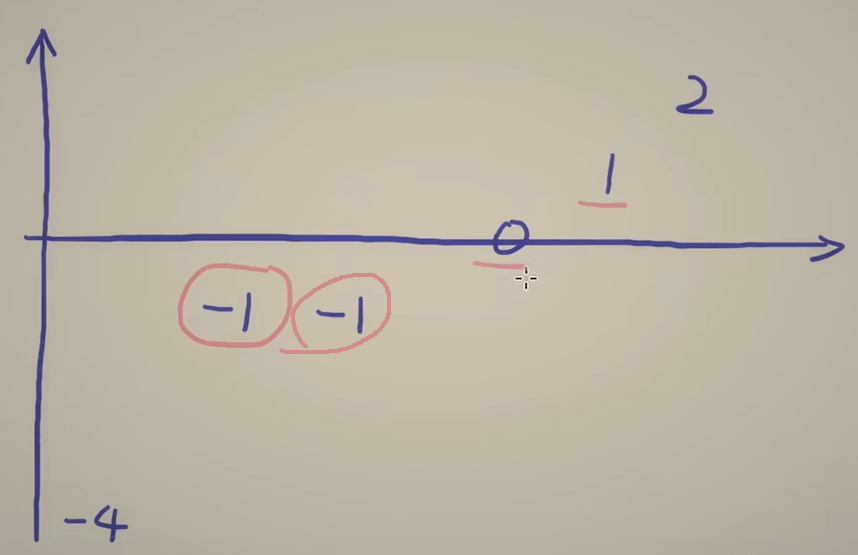
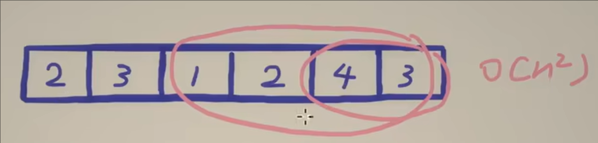

本篇文章主要为灵神基础算法系列的第一期到第三期。这几个视频的主要内容是灵活使用双指针，去实现便捷快速的解题。灵活利用指针的时间复杂度与空间复杂度往往超越暴力解题很多很多，作者想和大家分享一下自己在学习时的心得，以下代码都是c++格式，第一次码文，有表述不当的地方请大家多多谅解。

# 1、三数之和
## 两数之和
三数之和的基础问题是两数之和，力扣题目如下：
[167. 两数之和 II - 输入有序数组](https://leetcode.cn/problems/two-sum-ii-input-array-is-sorted/description/) 
对于以上问题，我第一时间想到的思路是暴力遍历整个数组，用排序组合的思想，把两个数两两配对，最后找到答案。这样的思路固然直白，但是我们提交时会发现有几个测试点会超时。这就是上文提到的时间复杂度过高，那么有什么方法可以改进呢？注意到题目中给出的数组是一个递增的数组，我们可以好好利用这一条件。
我们可以整两个指针，指针1指向最小数，指针2指向最大数，然后在指针1与2不交汇的情况下，尝试将指针1和指针2的数相加，把得到的数与target对比。如果比target小，说明最小数拖了后腿，那我们把指针1往后移，令其对应的数字变大，重复以上步骤直到两数和等于target，所得指针对应数字便是答案。代码如下：
``` C++
vector<int> twoSum(vector<int>& numbers, int target){
    int left = 0, right = numbers.size() - 1;
    while (true) {
        int s = numbers[left] + numbers[right];
        if (s == target) {
            return {left + 1, right + 1}; // 题目要求下标从 1 开始
        }
        s > target ? right-- : left++;
    }
}
```

#### 如果题目给我们的数组是无序的，我们也可以先排序后解题

## 三数之和
三数之和的题目与两数之和类似，力扣题目如下：
[15. 三数之和](https://leetcode.cn/problems/3sum/description/) 
注意到该题target为0，即：a+b+c=0。那么我们可不可以把问题转化一下，变成b+c=-a，转变成我们熟悉的两数之和题目。在这里由于题目没有要求三元组的顺序，我们可以规定a\<b\<c，然后遍历在0和nums.length()-2之间遍历a，在a的右侧依照两数之和的思路去解题。
**本题还有一个值得注意的地方**，即题目中要求三元组不能重复。那么何时会有重复呢？如下图所示：

我们注意到当a取第一个-1时，a=-1,b=0,c=1符合题目要求。当a取第二个-1时，a=-1,b=0,c=1也符合题目要求。所以当我们遍历a时，应当注意相邻数字相同的情况。所以我们可以给a的遍历加个条件:
``` bash
if(i>0 && nums[i]==nums[i-1]){
    continue;
}
```
**那么本题还可以继续优化吗？**答案是可以的，我们来看以下优化代码：
``` C++
if(nums[i]+nums[i+1]+nums[i+2]>0){
    break;
}
// 当最小的三个数相加都大于0，说明后面的数字任取三个相加也大于0，故后面不存在答案，所以不用遍历了，直接break
if(nums[i]+nums[n-1]+nums[n-2]<0){
    continue;
}
// 当a与最大的两个数相加都小于0，所以当前a拖后腿了，继续遍历，把a增大直到找到符合条件的a
```
# 2、接雨水
接雨水是一类特别搞的题目，一开始接触的时候可能摸不着头脑，但做过几次以后便可以熟悉掌握套路。
## 盛最多水的容器
接雨水的基础问题是盛最多水的容器，力扣题目如下：
[11. 盛最多水的容器](https://leetcode.cn/problems/container-with-most-water/description/) 
这道题的难点在于如何翻译题目，我们把数组划分为一个个容器，容器储存的水量可以用两边的最小值作为高，两边的距离作为底，底x高得到储水量。这道题固然可以暴力拆解成不同容器，但可以用双指针来做会更加便捷。
我们可以像两数之和一样创建两个指针并指到一头一尾，然后用储水量公式计算容器的储水量。计算完以后我们该如何移动指针呢？我们想要找到一个比当前容器还能装的容器，那么我们要移动拖后腿的指针，即更矮的那一条边。如果两边一样高，那移动谁都可以。正如以下代码：
``` C++
while (left < right) {
            int area = (right - left) * min(height[left], height[right]); //计算储水量
            ans = max(ans, area);  // 比较最大值与当前容器储水值
            height[left] < height[right] ? left++ : right--; // 移动短边
        }
```

## 接雨水
接雨水这道题目与上一题区别在于给出的数组不再是一条条边，而是一个个方块，力扣题目如下：
[42. 接雨水](https://leetcode.cn/problems/trapping-rain-water/description/) 
灵神在视频中提到了两种方法，在我看来这两种方法都是一样的。这道题目的储水量是用前缀最大值和后缀最大值去计算,前缀最大值和后缀最大值其实是该容器的两条边，容器的宽度为1。
#### 前后缀分解法
我们可以用两个数组pre_max与suf_max分别去储存前缀最大值与后缀最大值,那么储水量公式为v[i]=min(pre_max[i],suf_max[i])-nums[i]。再遍历整个数组，把所有储水量相加即可。以下是详细代码：
``` C++
int trap(vector<int>& height) {
        int n = height.size();
        vector<int> pre_max(n); // pre_max[i] 表示前缀最大值
        pre_max[0] = height[0];
        for (int i = 1; i < n; i++) {
            pre_max[i] = max(pre_max[i - 1], height[i]);
        }

        vector<int> suf_max(n); // suf_max[i] 表示后缀最大值
        suf_max[n - 1] = height[n - 1];
        for (int i = n - 2; i >= 0; i--) {
            suf_max[i] = max(suf_max[i + 1], height[i]);
        }

        int ans = 0;
        for (int i = 0; i < n; i++) {
            ans += min(pre_max[i], suf_max[i]) - height[i]; // 累加每个水桶能接多少水
        }
        return ans;
``` 
#### 相向双指针法
相向双指针法其实是使用两个指针储存前缀最大值与后缀最大值，并非数组。我们可以把两个指针left，right分别指向一头一尾，然后在算储水量的时候比较两个指针所指向的数字。
如果前缀最大值<后缀最大值，那么left所在容器的短边是前缀最大值（短边原则），我们在计算完该容器储水量后将其向后移。
如果前缀最大值>后缀最大值，那么right所在容器的短边是后缀最大值（短边原则），我们在计算完该容器储水量后将其向前移。
以此类推，知道两个指针相遇位置，再把所有容器的储水量相加就是最后的答案。具体代码如下：
``` C++
int trap(vector<int>& height) {
        int ans = 0, left = 0, right = height.size() - 1, pre_max = 0, suf_max = 0; // 初始化指针
        while (left < right) {
            pre_max = max(pre_max, height[left]); // 更新前缀最大值
            suf_max = max(suf_max, height[right]); // 更新后缀最大值
            ans += pre_max < suf_max ? pre_max - height[left++] : suf_max - height[right--]; // 更新指针并添加答案
        }
        return ans;
}
``` 
**相向双指针法**的优点在于哪里呢？它使用了指针储存前后缀最大值，而非数组。从而获得了更优的空间复杂度：
时间复杂度为 O(n)，空间复杂度为 O(1)，优于传统的前后缀分解法（空间复杂度 O(n)）。

# 3、滑动窗口
滑动窗口的含义：
1.维护一个有条件的滑动窗口
2.右端点右移，导致窗口扩大，导致无法满足题目所要求的条件
3.左端点右移目的是为了缩小窗口，重新满足条件
以下是几道例题。
## 长度最小的子数组
这道题目使用暴力解法会超时，是滑动窗口的经典例题，力扣题目如下：
[209. 长度最小的子数组](https://leetcode.cn/problems/minimum-size-subarray-sum/description/) 
我们想要求的的答案长度最小，其实可以先找出一个答案，然后向右拓展答案，再在左边慢慢减少答案的范围，从而得到最短的答案，这就是滑动窗口的思路。其原理其实是我们向右边拓展的数字很大，可以抵消左边减少的数字，比如右边是3，那左边可以减少1和2，从而达到减小答案长度的目的。
``` C++
int minSubArrayLen(int target, vector<int>& nums) {
        int n = nums.size(), ans = n + 1, sum = 0, left = 0;
        for (int right = 0; right < n; right++) { // 枚举子数组右端点
            sum += nums[right]; //把右端点的数字加进去
            while (sum >= target) { //当sum>=target满足要求，可以在左边慢慢减小答案长度
                ans = min(ans, right - left + 1); //更新答案
                sum -= nums[left]; //减小答案长度
                left++; //左端点右移
            }
        }
        return ans <= n ? ans : 0; //返回答案，如果没有答案则返回0
}
``` 


## 乘积小于 K 的子数组
这道题目与上题类似，力扣题目如下：
[713. 乘积小于 K 的子数组](https://leetcode.cn/problems/subarray-product-less-than-k/description/) 
这题求的是满足要求的子数组的**个数**，并非上一题的最短长度，那我们怎么找呢？
我们设置两个指针left和right，注意到如果[left,right]满足要求的话， 那么[left+1,right],[left+2,right]......[right,right]都是满足要求的(ps:这里的子数组和我们平时学的排列组合的子序列不一样，这个是单方向削减得到的子序列，所以不会重复)，所以共有right-left+1个子数组，然后我们把right-left+1加入答案中，更新left与right，最后得到总答案。代码如下：
``` C++
 int numSubarrayProductLessThanK(vector<int>& nums, int k) {
    if (k <= 1) { //当target<=1时，肯定不满足条件
        return 0;
    }
    int ans = 0, prod = 1, left = 0; // 初始化节点
    for (int right = 0; right < nums.size(); right++) { //开 始遍历右端点
        prod *= nums[right];
        while (prod >= k) { // 不满足要求则把左节点右移
            prod /= nums[left];
            left++; // 缩小窗口
        }
        ans += right - left + 1; // 对于固定的 right，有 right-left+1 个合法的左端点
    }
    return ans;
}
``` 
## 无重复字符的最长子串
这道题目比较好理解，力扣题目如下：
[3. 无重复字符的最长子串](https://leetcode.cn/problems/longest-substring-without-repeating-characters/description/) 
我们设置两个指针，left指向首元素，利用right不断遍历数组直到出现重复元素为止。出现重复元素之后，我们的left要不断右移，直到把重复的元素踢出数组。然后重新遍历right，重复以上步骤。
不过有个难点，我们该**如何检测重复字符**呢，一个个遍历太麻烦，我们可以引入一个哈希表。我们知道字符的ASCLL码最多时128，所以我们可以int Ascll[128]，以0为未出现，1为已出现。通过检测Ascll中的数值，便可知道当前元素是否有出现。具体代码如下：
``` C++
int lengthOfLongestSubstring(string s) {
    int n = s.length(), ans = 0, left = 0;
    unordered_map<char, int> cnt; // 利用unordered_map维护从下标 left 到下标 right 的字符
    for (int right = 0; right < n; right++) {
        char c = s[right];
        cnt[c]++; // map中的值加1
        while (cnt[c] > 1) { // 窗口内有重复字母
            cnt[s[left]]--; // 移除窗口左端点字母
            left++; // 缩小窗口
        }
        ans = max(ans, right - left + 1); // 更新窗口长度最大值
    }
        return ans;
}
``` 