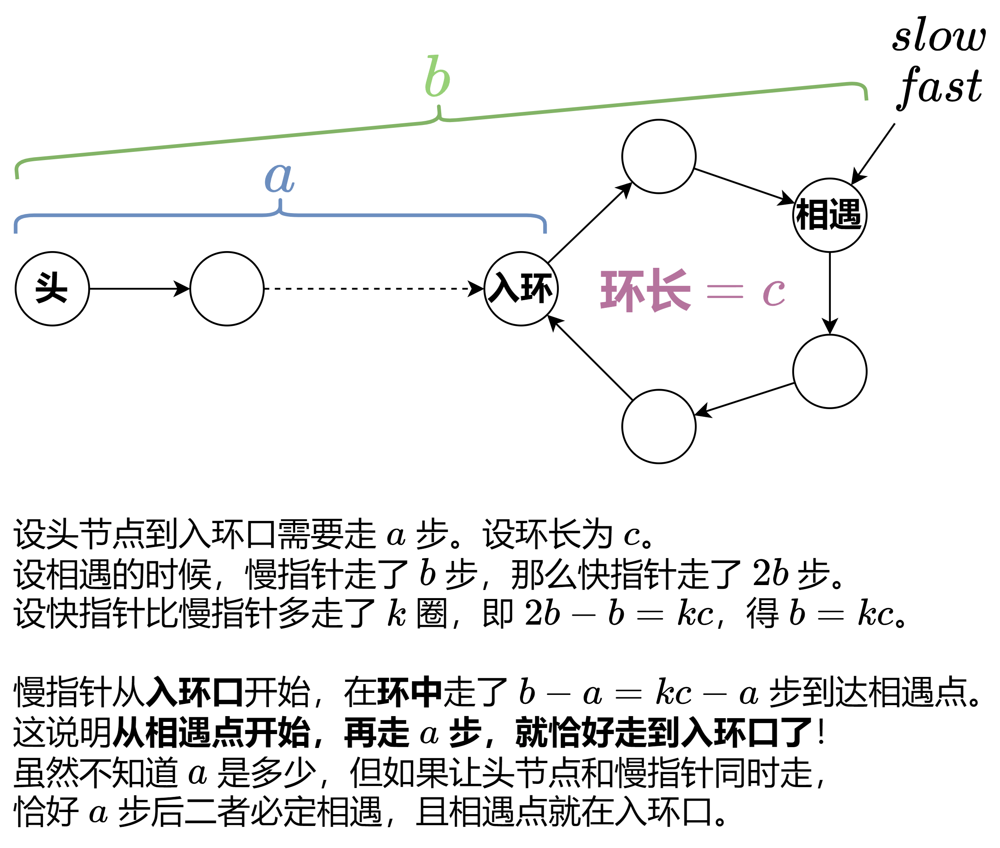
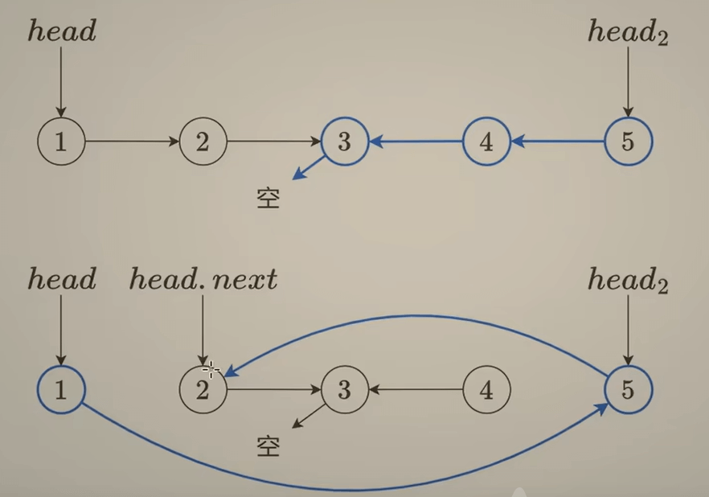

今天我们来学习灵神基础算法系列的第六期和第七期和第八期。这三个视频讲的是链表相关的题目。我们在学习c语言的时候也学过链表，那我们在c++中如何实现链表呢。其实和C语言差不多，我们可以定义一个**链表类**，再进行链表的操作。
```C++
template<typename T>
class Node {
public:
    T data;
    Node* next;
    Node(T value) : data(value), next(nullptr) {}
    Node(int x, Node *next) : val(x), next(next) {}
};
```

# 一、反转链表
## 1、反转链表
这道题是链表的基础题，力扣题目如下：
[206. 反转链表](https://leetcode.cn/problems/reverse-linked-list/description/) 
表为 1→2→3。创建一个新的空链表，然后用头插法依次把节点 1,2,3 插到这个新链表的头部，就得到了链表 3→2→1，这正是反转后的链表。由于我们只用到了几个额外的变量，所以空间复杂度是O(1),时间复杂度是O(n),具体代码如下：
```C++
class Solution {
public:
    ListNode* reverseList(ListNode* head) {
        ListNode* pre = nullptr; // 被链接的节点
        ListNode* cur = head; //当前节点
        while (cur) {
            ListNode* nxt = cur->next; // 先把下一个要反转的节点存起来，避免找不到
            cur->next = pre; // 反转过程
            pre = cur; // 更新pre
            cur = nxt; // 更新当前节点
        }
        return pre;
    }
};
```
## 2、反转链表 II
这题与上题不同，只用反转一部分的链表，力扣题目如下：
[92. 反转链表 II](https://leetcode.cn/problems/reverse-linked-list-ii/description/) 
这题可以在头节点前引入一个虚拟节点dummy：ListNode dummy(0, head)。问题在于left和right两个节点我们该如何链接呢。我们可以按照上一题的思路先把该部分链表进行反转，然后再分别对left和right两个节点进行处理。代码如下：
```C++
class Solution {
public:
    ListNode* reverseBetween(ListNode* head, int left, int right) {
        ListNode dummy(0, head); // 设置虚拟头节点
        ListNode* p0 = &dummy;
        for (int i = 0; i < left - 1; i++) {
            p0 = p0->next;
        } // 找到反转的起点，即left的前一节点

        ListNode* pre = nullptr;
        ListNode* cur = p0->next;
        for (int i = 0; i < right - left + 1; i++) { // 按照上一题思路反转链表，注意循环条件改成了循环次数
            ListNode* nxt = cur->next;
            cur->next = pre; // 每次循环只修改一个 next，方便大家理解
            pre = cur;
            cur = nxt;
        }

        p0->next->next = cur; // 处理left节点
        p0->next = pre; // 处理right节点
        return dummy.next;
    }
};
```
有些互联网公司例如美团，在面试这道题的时候会要求一次遍历。我们上述方法虽然用了两次循环，但本质是一次遍历，因为每个元素只被访问了**一遍**。

## 3、K 个一组翻转链表
这题难度继续升级，要求每K个节点反转一次，力扣题目如下：
[25. K 个一组翻转链表](https://leetcode.cn/problems/reverse-nodes-in-k-group/description/) 
这道题和上一个题类似，区别在于这道题要反转很多个部分，我们首先得先找出来有多少组，然后我们需要在每一次反转后把p0更新为下一次反转起点的前一个节点，这个更新比较难。代码如下：
```C++
class Solution {
public:
    ListNode* reverseKGroup(ListNode* head, int k) {
        // 统计节点个数
        int n = 0;
        for (ListNode* cur = head; cur; cur = cur->next) {
            n++;
        }

        ListNode dummy(0, head); // 设置虚拟头节点
        ListNode* p0 = &dummy; // 找到第一个反转的起点，即left的前一节点
        ListNode* pre = nullptr;
        ListNode* cur = head;

        // k 个一组处理
        for (; n >= k; n -= k) {
            for (int i = 0; i < k; i++) { // 同上一题反转部分链表
                ListNode* nxt = cur->next;
                cur->next = pre; // 每次循环只修改一个 next，方便大家理解
                pre = cur;
                cur = nxt;
            }

            // 更新p0节点，p0的下一个位置恰好是p0->next
            ListNode* nxt = p0->next; // 因为p0的next会先改变，所以要先储存起来
            p0->next->next = cur;
            p0->next = pre;
            p0 = nxt; //更新p0节点
        }
        return dummy.next;
    }
};
```

# 二、快慢指针
## 1、链表的中间结点
这道题比较简单，力扣题目如下：
[876. 链表的中间结点](https://leetcode.cn/problems/middle-of-the-linked-list/description/)
这道题我们直白点做可以先遍历整个链表，计算出节点的个数，然后再从头节点出发寻找中间节点。如果我们运用**快慢指针**的话，可以使快指针每次运动两步，慢指针每次运动一步，当慢指针到最后一个节点（**奇数个数**）或者空指针（**偶数个数**）时，慢指针所在的位置符合条件。
```C++
class Solution {
public:
    ListNode* middleNode(ListNode* head) {
        ListNode* slow = head;
        ListNode* fast = head;
        while (fast && fast->next) {
            slow = slow->next;
            fast = fast->next->next;
        }
        return slow;
    }
};
```
## 2、环形链表
这道题也比较简单，力扣题目如下：
[141. 环形链表](https://leetcode.cn/problems/linked-list-cycle/description/)
我们利用快慢指针来做的话，因为快指针每次都比慢指针快一步，所以如果有环，快指针一定会追上慢指针，如果没有环的话，快指针会遍历整个链表，直到指向空节点。代码如下：
```C++
class Solution {
public:
    bool hasCycle(ListNode* head) {
        ListNode* slow = head;
        ListNode* fast = head; // 乌龟和兔子同时从起点出发
        while (fast && fast->next) {
            slow = slow->next; // 乌龟走一步
            fast = fast->next->next; // 兔子走两步
            if (fast == slow) { // 兔子追上乌龟（套圈），说明有环
                return true;
            }
        }
        return false; // 访问到了链表末尾，无环
    }
};
```

## 3、环形链表 II
这一题是上一题的升级版，只不过返回值要求你找出他们的连接点，力扣题目如下：
[142. 环形链表 II](https://leetcode.cn/problems/linked-list-cycle-ii/description/)
其实这题是在找快慢指针移动距离的关系，从而去寻找入环口的位置。假设头节点到环形节点为a步，慢指针走了b步，那么快指针就走了2b步。相遇时快指针多走的b步其实是k圈的环形链表，即b=kc。慢指针在入环口开始走了b-a步，即kc-a步。这代表无论是否经过多次，慢指针在a步后肯定会在入环口。虽然我们不知道a是多少，但是头节点移动a步也是入环口，所以我们可以让头节点和慢指针同时移动，当他们相遇时肯定就是入环口。如下图：

```C++
class Solution {
public:
    ListNode* detectCycle(ListNode* head) {
        ListNode* slow = head;
        ListNode* fast = head;
        while (fast && fast->next) { //正常快慢指针遍历
            slow = slow->next;
            fast = fast->next->next;
            if (fast == slow) { // 相遇
                while (slow != head) { // 再走 a 步head与slow相遇，即环形起点
                    slow = slow->next;
                    head = head->next;
                }
                return slow;
            }
        }
        return nullptr;
    }
};

```

## 4、重排链表
这道题非常综合，用到了前几题的知识，力扣题目如下：
[143. 重排链表](https://leetcode.cn/problems/reorder-list/description/)
首先我们要把链表分开来看，以1->2->3->4->5为例，重排后是1->5->2->4->3注意到它的奇偶顺序分别是1->2->3和5->4，所以我们可以先找到原链表的中心节点，把它从中间开始进行一个反转，然后在按照题目进行链接(类似反转链表 II那样处理head和head2的链接)，注意因为我们这里改变了head的next与head2的next，也是需要提前储存。注意循环条件是head2->next而不是head2，因为奇偶个数的链表在中间节点的查找是不一样的。代码如下：
```C++
class Solution {
    // 876. 链表的中间结点，找出中间节点
    ListNode* middleNode(ListNode* head) {
        ListNode* slow = head, *fast = head;
        while (fast && fast->next) {
            slow = slow->next;
            fast = fast->next->next;
        }
        return slow;
    }

    // 206. 反转链表，把后半部分反转
    ListNode* reverseList(ListNode* head) {
        ListNode* pre = nullptr, *cur = head;
        while (cur) {
            ListNode* nxt = cur->next;
            cur->next = pre;
            pre = cur;
            cur = nxt;
        }
        return pre;
    }

public:
    void reorderList(ListNode* head) {
        ListNode* mid = middleNode(head); // 找出中间节点
        ListNode* head2 = reverseList(mid); //把后半部分反转
        while (head2->next) {
            ListNode* nxt = head->next;
            ListNode* nxt2 = head2->next;
            head->next = head2;
            head2->next = nxt;
            head = nxt;
            head2 = nxt2;
        }
    }
};
```
关于最后的head与head2处理如下图：


# 三、删除链表
## 1、删除链表中的节点
这道题有点搞，更像是脑筋急转弯。只给了我们要删除的节点，力扣题目如下：
[237. 删除链表中的节点](https://leetcode.cn/problems/delete-node-in-a-linked-list/description/)
这道题没有给我们头节点，导致我们不知道算删除节点的上一个节点是什么，所以我们需要转换思路，把删除节点下一个节点的值赋给自己，再把下一个节点删除，代码如下：
```C++
class Solution {
public:
    void deleteNode(ListNode* node) {
        *node = *node->next;
    }
};
```

## 2、删除链表的倒数第 N 个结点
这道题也可以利用上一题的思路解决，力扣题目如下：
[19. 删除链表的倒数第 N 个结点](https://leetcode.cn/problems/remove-nth-node-from-end-of-list/description/)
按照正常的思路我们会遍历整个链表，弄清楚链表有几个节点，然后再倒推倒数第N个节点是什么，对他进行删除。但是我们也可以利用上一题的删除思路，用前后指针去解决。我们可以依旧创建一个虚拟头节点dummy，令right指针等于dummy，让right向右移动n个节点，再创建left指针，与right一起向右移动，那么left与right一直保持了n的距离，当right指针到达最后一个节点时，则left就是倒数n+1个节点，再删除即可，代码如下：
```C++
class Solution {
public:
    ListNode* removeNthFromEnd(ListNode* head, int n) {
        // 由于可能会删除链表头部，用哨兵节点简化代码
        ListNode dummy{0, head};
        ListNode* left = &dummy;
        ListNode* right = &dummy;
        while (n--) {
            right = right->next; // 右指针先向右走 n 步
        }
        while (right->next) {
            left = left->next;
            right = right->next; // 左右指针一起走
        }
        // 左指针的下一个节点就是倒数第 n 个节点
        ListNode* nxt = left->next;
        left->next = left->next->next;
        delete nxt;
        return dummy.next;
    }
};
```

## 3、删除排序链表中的重复元素
这题比较简单，力扣题目如下：
[83. 删除排序链表中的重复元素](https://leetcode.cn/problems/remove-duplicates-from-sorted-list/description/)
我们可以直接遍历数组，如果下一个节点存在，且等于当前节点的值，那么便删除，不然的话就跳过,代码如下
```C++
class Solution {
public:
    ListNode* deleteDuplicates(ListNode* head) {
        if (head == nullptr) {
            return nullptr;
        }
        ListNode* cur = head;
        while (cur->next) { // 看看下个节点……
            if (cur->next->val == cur->val) { // 和我一样，删！
                cur->next = cur->next->next;
            } else { // 和我不一样，移动到下个节点
                cur = cur->next;
            }
        }
        return head;
    }
};
```

## 4、删除排序链表中的重复元素 II
这题比较简单，力扣题目如下：
[82. 删除排序链表中的重复元素 II](https://leetcode.cn/problems/remove-duplicates-from-sorted-list-ii/description/)
这道题还是使用了虚拟头节点dummy，因为这道题有可能删除头节点head，我们可以使用两个循环，第一个循环用来遍历链表，第二个循环用来删除重复的节点，代码如下：
```C++
class Solution {
public:
    ListNode* deleteDuplicates(ListNode* head) {
        ListNode dummy(0, head);
        auto cur = &dummy;
        while (cur->next && cur->next->next) {
            int val = cur->next->val;
            if (cur->next->next->val == val) { // 后两个节点值相同
                // 值等于 val 的节点全部删除
                while (cur->next && cur->next->val == val) {
                    cur->next = cur->next->next;
                }
            } else {
                cur = cur->next;
            }
        }
        return dummy.next;
    }
};
```

# 四、总结
## 1、什么时候用到虚拟头节点dummy
如果题目中可能会删除头节点，那我们需要使用dummy来保存我们链表的开头，这样的话才能return对。
## 2、快慢指针与前后指针的区别
（1）**快慢指针**一半指快指针和慢指针同时出发，但是遍历的速度不一样，导致了快指针可能追上慢指针（环状链表中），或者当快指针走到结尾时，慢指针刚好满足题目条件。
（2）**前后指针**则是两个指针不同时间出发，而速度一样，这保证了他们之间的距离不变，可以用来删除倒数第N个节点