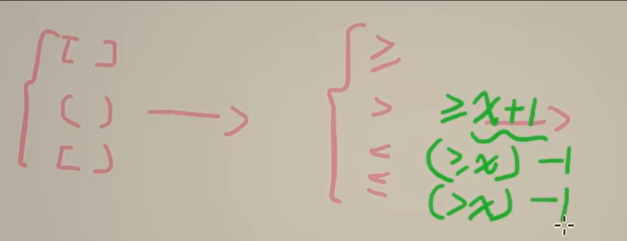

今天我们来学习灵神基础算法系列的第四期和第五期。这两个视频其实也讲的是指针的妙用。二分查找是快速查找元素的一种办法，比暴力遍历数组更加节约时间，他的原理非常简单，就是不断地使用二分法去寻找符合条件的元素，但在实现时有一些注意事项，下面和大家分享一下。

# 一、开闭区间与二分查找典例代码
我们在写二分查找时会用到一个循环，循环的终止条件与我们选择的开闭区间有着重要的联系，一个不小心将会陷入死循环，导致无法结束代码。这里给大家介绍我比较喜欢的**开区间写法**，非常方便好记。以下代码是灵神的一个典例代码，作用为找到有序数组中第一个大于等于target元素的位置，如果没有符合的元素，则返回数组长度。
``` C++
int lower_bound(vector<int>& nums, int target) {
        int left = -1, right = nums.size(); #因为-1和nums.size()都越界，所以我们实际上询问的区间是开区间 (left, right)
        while (left + 1 < right) { //为什么是加1，因为左右相差2以上区间才不为空，满足循环条件
        // 循环不变量right就是我们的目标：
        // nums[left] < target
        // nums[right] >= target
        int mid = left + (right - left) / 2; // 防止数据过大而溢出
        if (nums[mid] >= target) {
            right = mid; #范围缩小到 (left, mid)
        } else {
            left = mid; #范围缩小到 (mid, right)
        }
    }
    // 循环结束后 left+1 = right
    // 此时 nums[left] < target 而 nums[right] >= target
    // 所以 right 就是第一个 >= target 的元素下标
    return right;
}
``` 
以上的基础代码可以应用到其他情况，比如下图：

### 注意只有在有序数组中才可使用

# 二、例题
## 1、在排序数组中查找元素的第一个和最后一个位置
这道题简单直白，利用刚刚提到的典例代码便可轻松实现，力扣题目如下：
[34. 在排序数组中查找元素的第一个和最后一个位置](https://leetcode.cn/problems/find-first-and-last-position-of-element-in-sorted-array/description/) 
本道题需要注意的是，找最后一个位置的本质其实是找target+1第一次出现的位置，只要把那个位置往前移一位便可得到答案，代码如下
``` C++
int start = lower_bound(nums, target);
if (start == nums.size() || nums[start] != target) {
    return {-1, -1}; //start越界或nums中没有target
}
// 如果 start 存在，那么 end 必定存在
int end = lower_bound(nums, target + 1) - 1;
return {start, end};
``` 
## 2、寻找峰值
这道题目有点难应用上面的基础代码，题目给出的数组明明是无序的，我们该如何利用二分法呢。力扣题目如下：
[162. 寻找峰值](https://leetcode.cn/problems/find-peak-element/description/) 
对于这道题我们不需要关心数组整体是否有序，只需通过局部趋势判断峰值可能存在的区间：
***1***、若某位置mid满足nums[mid] < nums[mid+1]，说明从mid到mid+1是上坡。由于数组末尾是 “负无穷”，上坡的尽头必然有一个 “顶点”（否则会一直上升到末尾，而末尾的右侧是负无穷，末尾本身就是峰值），因此峰值一定在mid+1右侧（包括mid+1）。
**2**、若nums[mid] > nums[mid+1]，说明从mid到mid+1是下坡。由于数组开头是 “负无穷”，下坡的起点（或中途）必然有一个 “顶点”（否则会一直下降到开头，而开头的左侧是负无穷，开头本身就是峰值），因此峰值一定在mid左侧（包括mid）。

**所以我们只需比较nums[mid]与nums[mid+1]就好**
``` C++
int findPeakElement(vector<int>& nums) {
    int left = -1, right = nums.size() - 1; //开区间 (-1, n-1)
    while (left + 1 < right) { //开区间不为空
    int mid = left + (right - left) / 2;
    if (nums[mid] > nums[mid + 1]) {
        right = mid;
    } 
    else {
        left = mid;
    }
    }
    return right;
}
``` 
## 3、寻找旋转排序数组中的最小值
本题是有序数组，但是被旋转过，力扣题目如下：
[153. 寻找旋转排序数组中的最小值](https://leetcode.cn/problems/find-minimum-in-rotated-sorted-array/description/) 
这道题使用二分法时需要我们需要判断nums[mid]和数组最小值的位置关系，判断谁在左边，谁在右边，从而得到最小值的位置。那我们如何判断呢，其实我们只需要把nums[mid]与数组最后一个数对比：
   - 如果nums[mid]>nums[n−1]，我们就知道nums一定被分成左右两个递增段，最小值在nums[mid]的右边。
   - 如果nums[mid]<nums[n−1]，我们可以知道nums[mid]要不是最小值，要不最小值在nums[mid]的右边。
灵神的代码如下：
``` C++
int findMin(vector<int>& nums) {
    int left = -1, right = nums.size() - 1; //开区间 (-1, n-1)
    while (left + 1 < right) { #开区间不为空
        int mid = left + (right - left) / 2;
        (nums[mid] < nums.back() ? right : left) = mid;
    }
    return nums[right];
}
``` 
## 4、搜索旋转排序数组
本题是有序数组，但是被旋转过，而且和第1题结合了一下，题目自己给了我们target。力扣题目如下：
[33. 搜索旋转排序数组](https://leetcode.cn/problems/search-in-rotated-sorted-array/description/) 
这道题可以用两次二分来解决。首先用上一题的方法，找到 nums 的最小值的下标 i。然后利用例题1的寻找target的办法，但是要注意**分类讨论**：
- 如果 target>nums[n−1]，那么 target 一定在第一段 [0,i−1] 中，在 [0,i−1] 中二分查找 target。
- 如果 target≤nums[n−1]，：
    - 如果 i=0，说明 nums 是递增的，直接在 [0,n−1] 中二分查找 target。
    - 如果 i>0，那么 target 一定在第二段 [i,n−1] 中，在 [i,n−1] 中二分查找 target。
灵神的代码如下：
``` C++
class Solution {
    // 153. 寻找旋转排序数组中的最小值（返回的是下标）
    int findMin(vector<int>& nums) {
        int left = -1, right = nums.size() - 1; // 开区间 (-1, n-1)
        while (left + 1 < right) { // 开区间不为空
            int mid = left + (right - left) / 2;
            if (nums[mid] < nums.back()) {
                right = mid;
            } else {
                left = mid;
            }
        }
        return right;
    }

    // 有序数组中找 target 的下标
    int lower_bound(vector<int>& nums, int left, int right, int target) {
        while (left + 1 < right) { // 开区间不为空
            // 循环不变量：
            // nums[right] >= target
            // nums[left] < target
            int mid = left + (right - left) / 2;
            if (nums[mid] >= target) {
                right = mid; // 范围缩小到 (left, mid)
            } else {
                left = mid; // 范围缩小到 (mid, right)
            }
        }
        return nums[right] == target ? right : -1;
    }

public:
    int search(vector<int>& nums, int target) {
        int i = findMin(nums);
        if (target > nums.back()) { // target 在第一段
            return lower_bound(nums, -1, i, target); // 开区间 (-1, i)
        }
        // target 在第二段
        return lower_bound(nums, i - 1, nums.size(), target); // 开区间 (i-1, n)
    }
};
``` 
# 三、总结
#### 1、如果看到题目要求时间复杂度为 O(log n)，则大概率使用二分法来解题。
#### 2、其实二分法的题目都是运用基础代码的模板去解题，然后根据题目的条件去修改自己if语句里面的内容