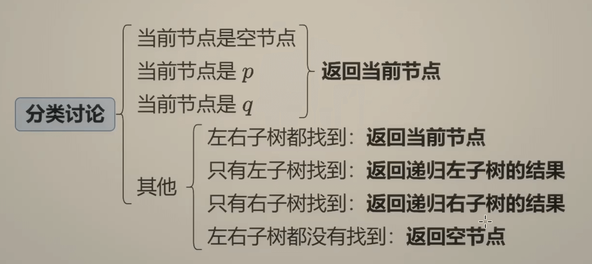

今天我们来学习灵神基础算法系列的第九期、第十期、第十一期、第十二期和第十三期。这五个视频全部在讲二叉树，暗藏了很多递归的思想，把二叉树的原问题转化为子问题，从而解答。
# 一、递归
## 1、递归的例题
我们用一道二叉树的例题来复习一下递归。力扣题目如下：
[104. 二叉树的最大深度](https://leetcode.cn/problems/maximum-depth-of-binary-tree/description/) 
这道题如果纠结于二叉树的具体细节，可能会想很久，但是我们可以利用递归把原问题转化为子问题，例如在这道题中，二叉树的深度我们可以看作是左右子树的最大深度+1，而左右子树的最大深度是不是也可以用上述的思路去求的，最后到达我们的**边界条件**，也就是当前节点为空的时候，我们返回0即可，代码如下：
```C++
class Solution {
public:
    int maxDepth(TreeNode* root) {
        if(root == nullptr){
            return 0;
        }
        else{
            return max(maxDepth(root->left),maxDepth(root->right))+1;
        }
    }
};
```
## 2、递归的底层原理
我们在做递归的时候，函数总是return来return去的，那么函数具体的运行顺序是怎么样的呢，我们可以结合栈的特性去理解。
递归运行的完整流程分为**递归阶段（递）** 和**回归阶段（归）**，缺一不可：
- 递归阶段（递）：
  函数从初始调用开始，不断通过自身调用自身向 “终止条件” 靠近。每次调用都会生成新的函数帧并压入调用栈，此时当前函数的执行会暂停，等待被调用的子函数返回结果。
  核心目标：触达终止条件（避免无限递归）。
- 回归阶段（归）：
  当子函数触达终止条件并返回结果后，调用栈开始 “出栈”，之前暂停的函数会从断点继续执行，使用子函数的返回结果完成自身计算，并将结果返回给上一层调用。
  核心目标：从终止条件反向计算，最终返回初始调用的结果。
## 3、如何思考递归的流程
1、思考题目的边界情况，识别最小子问题
2、建立原问题与子问题的关系，然后设计递归逻辑
3、明确函数的返回值是什么，从而设计递归函数的参数与返回值
4、手动模拟 “小规模输入” 的递归流程

# 二、二叉树形状相关题目
下面我们通过几道题来训练自己灵活使用递归
## 1、相同的树
这道题需要我们找出两棵二叉树是否相同，力扣题目如下：
[100. 相同的树](https://leetcode.cn/problems/same-tree/description/) 
这题我们仿照上一题递归的思路，可以把原二叉树是否相同**转化**为左右两颗子二叉树是否相同。
边界条件依旧是空节点,当出现空节点时，如果左右都为空，则返回true，不然就返回false。
这里还有个需要注意的点，除了子树相同外，当前节点的值也需要比较是否相同。
代码如下:
```C++
class Solution {
public:
    bool isSameTree(TreeNode* p, TreeNode* q) {
        if(!p || !q){
            if(p==q){
                return true;
            }
            return false;
        }
        return p->val==q->val&&isSameTree(p->left,q->left)&&isSameTree(p->right,q->right);
    }
};
```

## 2、对称二叉树
这道题需要我们找出两棵二叉树是否轴对称，力扣题目如下：
[101. 对称二叉树](https://leetcode.cn/problems/symmetric-tree/description/) 
这道题和上一题类似，要比较树1和树2是否轴对称，其实是比较**树1左子树和树2右子树**以及**树1右子树和树2左子树**是否相同，代码如下：
```C++
class Solution {
public:
    bool issame(TreeNode* p,TreeNode* q){
        if(!p||!q){
            return p==q;
        }
        return p->val==q->val&&issame(p->left,q->right)&&issame(p->right,q->left);
    }
    bool isSymmetric(TreeNode* root) {
        return issame(root->left,root->right);
    }
};
```

## 3、平衡二叉树
这道题需要我们判断一棵树是否是平衡二叉树（指该树所有节点的左右子树的高度相差不超过 1），力扣题目如下：
[110. 平衡二叉树](https://leetcode.cn/problems/balanced-binary-tree/description/) 
我们照样可以用递归的思想，原二叉树是否平衡**转化**为左右两颗子二叉树是否平衡，再加上左右子二叉树的长度相差不超过1。
边界条件依旧是空节点,当出现空节点时返回true，因为当前节点为空，则左右子树都为空，也就是平衡。
代码如下:
```C++
class Solution {
public:
    int treelength(TreeNode* root){ //第一题的代码：找出二叉树的最大深度
        if(root==nullptr){
            return 0;
        }
        return max(treelength(root->left),treelength(root->right))+1;
    }
    bool isBalanced(TreeNode* root) {
        if(root==nullptr){
            return true;
        }
        int left_length=treelength(root->left);
        int right_length=treelength(root->right);
        int n=left_length-right_length;
        return abs(n)<=1&&isBalanced(root->left)&&isBalanced(root->right);
    }
};
```

## 4、二叉树的右视图
这道题有点难度，需要我们找出二叉树从右向左看的投影，力扣题目如下：
[199. 二叉树的右视图](https://leetcode.cn/problems/binary-tree-right-side-view/description/) 
这道题需要处理两个难点，第一个是我们如何搜索投影，第二个是答案该如何储存。
- 对于第一个投影问题，我们也可以利用递归的思想，我们可以写一个搜索的函数，因为我们是从右往左看，所以可以先搜索右边，优先储存右边的节点，然后再搜索左边的节点
- 对于第二个答案储存的问题，我们可以利用数组的长度，如果数组的长度等于当前节点的深度，那么便要储存，不然的话当前节点已经被最右边的节点挡住了，所以不用储存。
综上，我们需要写一个带深度的搜索函数，代码如下：
```C++
class Solution {
public:
    void search(vector<int> &ans,TreeNode* node,int depth){ //搜索函数
        if(node==nullptr){
            return;
        }
        if(depth==ans.size()){ //根据答案的长度储存答案
            ans.push_back(node->val);
        }
        search(ans,node->right, depth + 1); //先搜索右边
        search(ans,node->left, depth + 1); //再搜索左边
    }
    vector<int> rightSideView(TreeNode* root) {
        vector<int> ans;
        search(ans,root,0);
        return ans;
    }
};
```

# 三、二叉搜索树
二叉搜索树定义如下：
- 节点的左子树只包含 严格小于 当前节点的数。
- 节点的右子树只包含 严格大于 当前节点的数。
- 所有左子树和右子树自身必须也是二叉搜索树。
根据递归的思路，我们有三种方法去辨别一颗二叉树是不是二叉搜索树，分别是**前序遍历**，**中序遍历**和**后续遍历**。力扣题目如下：
[98. 验证二叉搜索树](https://leetcode.cn/problems/validate-binary-search-tree/description/) 
## 1、前序遍历
前序遍历的“**前序**”体现在“根 → 左 → 右”的遍历顺序，我们先访问当前节点，再递归遍历左子树，最后递归遍历右子树。
在这道题目中，我们可以先验证当前节点是否符合条件，再验证他的左右子树是不是二叉搜索树，符合前序遍历的要求。
```C++
class Solution {
public:
    bool isValidBST(TreeNode* root, long long left = LLONG_MIN, long long right = LLONG_MAX) {
        if (root == nullptr) {
            return true;
        }
        long long x = root->val;
        return left < x && x < right &&
               isValidBST(root->left, left, x) &&
               isValidBST(root->right, x, right);
    }
};
```
以上还有个小细节：为什么要使用long类型？题目不是只有int类型吗？
- 答：虽然题目是 int 类型，但开始递归的时候，left 需要比所有节点值都要小，right 需要比所有节点值都要大，如果节点值刚好是 int 的最小值/最大值，就没有这样的 left 和 right 了，所以需要用 long 类型。

## 2、中序遍历
中序遍历的“**中序**”体现在“左 → 根 → 右”的遍历顺序，我们先递归遍历左子树，再访问当前根节点，最后递归遍历右子树。
原理在于搜索二叉树按左 → 根 → 右的顺序是递增的，所以可以把二叉搜索树看成一个有序数组。
怎么判断一个数组是有序数组？比较相邻元素的大小即可。
```C++
class Solution {
    long long pre = LLONG_MIN;
public:
    bool isValidBST(TreeNode* root) {
        if (root == nullptr) {
            return true;
        }
        if (!isValidBST(root->left)) { // 左：先遍历左子树，左子树的所有节点会先被访问，左子树是不是二叉搜索树
            return false;
        }
        if (root->val <= pre) { // 中:检查根节点是否大于左子树的最后一个节点
            return false;
        }
        pre = root->val; // 更新最后一个节点
        return isValidBST(root->right); // 右
    }
};
```

## 3、后序遍历
后序遍历的**后序**体现在“左 → 右 → 根”的遍历顺序，我们先递归遍历左子树，再递归遍历右子树，最后访问当前根节点。
我们先彻底验证左、右子树（确认它们是搜索树，并获取左子树的最大值、右子树的最小值），最后用子树的信息验证根节点（**根节点值是否大于左子树最大值、小于右子树最小值**）。
```C++
class Solution {
    pair<long long, long long> dfs(TreeNode* node) {
        if (node == nullptr) {
            return {LLONG_MAX, LLONG_MIN}; //针对空节点的特殊处理，确保父节点的x > 左子树最大值恒成立与父节点的x < 右子树最小值恒成立。
        }
        auto[l_min, l_max] = dfs(node->left);
        auto[r_min, r_max] = dfs(node->right);
        long long x = node->val;
        // 也可以在递归完左子树之后立刻判断，如果发现不是二叉搜索树，就不用递归右子树了
        if (x <= l_max || x >= r_min) { //验证是否为搜索树
            return {LLONG_MIN, LLONG_MAX}; //如果不是搜索树就返回就会{LLONG_MIN, LLONG_MAX}
        }
        return {min(l_min, x), max(r_max, x)};
    }

public:
    bool isValidBST(TreeNode* root) {
        return dfs(root).second != LLONG_MAX; // 如果pair的second是LLONG_MAX，就不是搜索树
    }
};
```

# 四、最近公共祖先
## 1、二叉树的最近公共祖先
这道题给定一个二叉树, 找到该树中两个指定节点的最近公共祖先（一个节点也可以是它自己的祖先）。力扣题目如下：
[236. 二叉树的最近公共祖先](https://leetcode.cn/problems/lowest-common-ancestor-of-a-binary-tree/description/) 
这道题也可以用递归的思想，我们分类讨论一下:

```C++
class Solution {
public:
    TreeNode* lowestCommonAncestor(TreeNode* root, TreeNode* p, TreeNode* q) {
        if (root == nullptr || root == p || root == q) {
            return root; // 找到 p 或 q 就不往下递归了，原因见上面答疑
        }
        TreeNode* left = lowestCommonAncestor(root->left, p, q);
        TreeNode* right = lowestCommonAncestor(root->right, p, q);
        if (left && right) { // 左右都找到
            return root; // 当前节点是最近公共祖先
        }
        // 如果只有左子树找到，就返回左子树的返回值
        // 如果只有右子树找到，就返回右子树的返回值
        // 如果左右子树都没有找到，就返回 nullptr（注意此时 right = nullptr）
        return left ? left : right;
    }
};
```
这里需要注意的是我们函数究竟返回了什么，为什么我们返回了root、left、right就能找出最近公共祖先。
- 其实返回值的准确含义是「最近公共祖先的候选项」。对于最外层的递归调用者来说，返回值是最近公共祖先的意思。但是，在递归过程中，返回值可能是最近公共祖先，也可能是空节点（表示子树内没找到任何有用信息）、节点 p 或者节点 q（可能成为最近公共祖先，或者用来辅助判断上面的某个节点是否为最近公共祖先）。


## 2、二叉搜索树的最近公共祖先
这道题除了可以用上一题的代码，还可以用二叉搜索树的性质去解题。力扣题目如下：
[235. 二叉搜索树的最近公共祖先](https://leetcode.cn/problems/lowest-common-ancestor-of-a-binary-search-tree/description/) 
因为二叉搜索树保证了每个节点的值都有大小关系，所以我们判断p和q在左子树还是右子树时，可以通过值去判断。
```C++
class Solution {
public:
    TreeNode *lowestCommonAncestor(TreeNode *root, TreeNode *p, TreeNode *q) {
        int x = root->val;
        if (p->val < x && q->val < x) { // p 和 q 都在左子树
            return lowestCommonAncestor(root->left, p, q);
        }
        if (p->val > x && q->val > x) { // p 和 q 都在右子树
            return lowestCommonAncestor(root->right, p, q);
        }
        return root; // 其它
    }
};
```
# 五、广度优先搜索
## 1、二叉树的层序遍历
这道题要求我们逐层地，从左到右访问二叉树的所有节点，力扣题目如下：
[102. 二叉树的层序遍历](https://leetcode.cn/problems/binary-tree-level-order-traversal/description/)
这道题是广度优先搜索的典例题目，我们需要优先往更广的地方遍历，其次才是深度，题目的难点在于我们如何储存已遍历的节点和待遍历的节点。
这需要我们用到队列，利用其先进先出的特点，把节点储存到数组中，遍历前面的节点的子节点，并把它们放进队列的后面，以此类推，代码如下：
```C++
class Solution {
public:
    vector<vector<int>> levelOrder(TreeNode* root) {
        if (root == nullptr) {
            return {};
        }
        vector<vector<int>> ans;
        queue<TreeNode*> q;
        q.push(root);
        while (!q.empty()) {
            vector<int> vals;
            for (int n = q.size(); n--;) {
                auto node = q.front();
                q.pop();
                vals.push_back(node->val);
                if (node->left)  q.push(node->left);
                if (node->right) q.push(node->right);
            }
            ans.emplace_back(vals);
        }
        return ans;
    }
};
```

## 2、二叉树的锯齿形层序遍历
这道题与上一题类似，区别在于需要一个锯齿形的遍历，力扣题目如下：
[103. 二叉树的锯齿形层序遍历](https://leetcode.cn/problems/binary-tree-zigzag-level-order-traversal/description/)
锯齿形的遍历其实也很简单，我们可以在偶数行把数组反转一下，代码如下：
```C++
class Solution {
public:
    vector<vector<int>> zigzagLevelOrder(TreeNode* root) {
        if(root==nullptr){
            return {};
        }
        vector<vector<int>> ans;
        queue<TreeNode*> q;
        q.push(root);
        int i=1; // 引入计数器
        while(!q.empty()){
            vector<int> vals;
            for(int n=q.size();n>0;n--){
                TreeNode* node=q.front();
                q.pop();
                vals.push_back(node->val);
                if(node->left){
                    q.push(node->left);
                }
                if(node->right){
                    q.push(node->right);
                }
            }
            if(i%2==0){ //计数器偶数时反转
                reverse(vals.begin(), vals.end());
            }
            i++;
            ans.push_back(vals);
        }
        return ans;
    }
};
```

## 3、找树左下角的值
这道题也可以使用广度优先搜索结合队列来做，力扣题目如下：
[513. 找树左下角的值](https://leetcode.cn/problems/find-bottom-left-tree-value/description/)
如果我们从左到右搜索，树左下角的值其实是最后一行的第一个值，但我们从右往左搜索的话，树左下角的值就会是最后一层的最后一个值，代码如下：
```C++
class Solution {
public:
    int findBottomLeftValue(TreeNode *root) {
        TreeNode *node;
        queue<TreeNode *> q;
        q.push(root);
        while (!q.empty()) {
            node = q.front(); q.pop();
            if (node->right) q.push(node->right);
            if (node->left)  q.push(node->left);
        }
        return node->val;
    }
};
```